# AIE OnRamp Session 3 - Visual Diagrams

This document provides visual diagrams to help understand the full-stack integration patterns, deployment architecture, and debugging workflows covered in Session 3: Connecting Frontend UIs to Backend Deployments.

---

## 1. Session 3 Context: Building on Sessions 1 & 2

This diagram shows how Session 3 integrates the skills learned in previous sessions into a complete full-stack application.

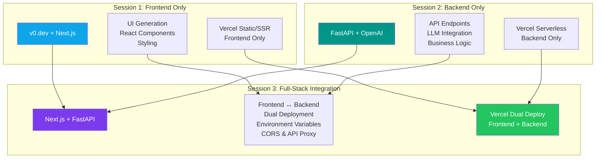

---

## 2. Repository Setup Workflow: From Course Code to Deployment

This diagram shows the required workflow for copying reference code into separate repositories for deployment.

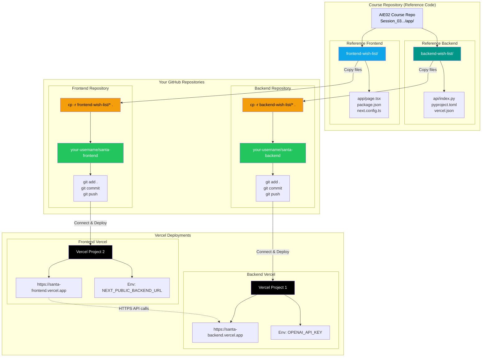

**Key Takeaway:** The course repository `app/` folder contains **reference code**. You must **copy** each service to its own separate GitHub repository using `cp -r`. NEVER deploy directly from the course repository. Each service needs its own repository connected to its own Vercel project.

---

## 3. Full-Stack Architecture Overview

This diagram shows the complete technology stack and how all components connect in the Santa Wish List application.

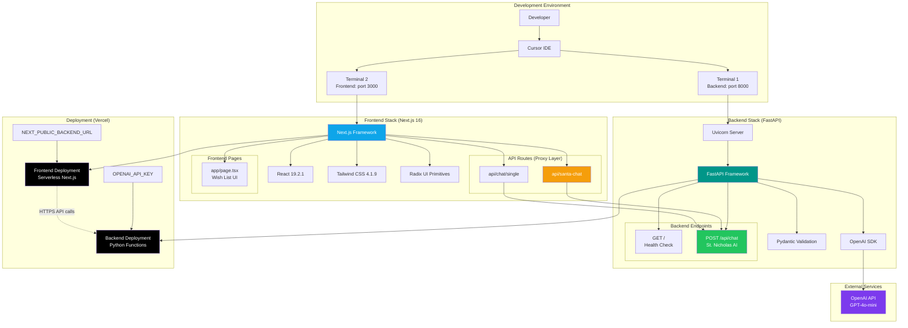

---

## 4. Complete Assignment Workflow (10 Steps)

This flowchart shows the step-by-step process from repository setup through complete deployment.

```mermaid
flowchart TD
    START([Start Assignment]) --> STEP1

    subgraph STEP1_BOX["Step 1: Create Separate Repositories"]
        STEP1[Create GitHub Repos]
        STEP1 --> STEP1A[Create: santa-backend repo]
        STEP1A --> STEP1B[Create: santa-frontend repo]
        STEP1B --> STEP1C[Clone both repos locally]
    end

    subgraph STEP2_BOX["Step 2: Copy Backend Code"]
        STEP2[Copy Backend to Repo]
        STEP2 --> STEP2A[cp -r app/backend-wish-list/* santa-backend/]
        STEP2A --> STEP2B[cd santa-backend]
        STEP2B --> STEP2C[git add . && commit && push]
    end

    STEP1C --> STEP2

    subgraph STEP3_BOX["Step 3: Backend Local Testing"]
        STEP3[Test Backend Locally]
        STEP3 --> STEP3A[uv sync]
        STEP3A --> STEP3B[Create .env with OPENAI_API_KEY]
        STEP3B --> STEP3C[uvicorn api.index:app --reload]
        STEP3C --> STEP3D[Test at localhost:8000/docs]
    end

    STEP2C --> STEP3

    subgraph STEP4_BOX["Step 4: Backend Deployment"]
        STEP4[Deploy Backend to Vercel]
        STEP4 --> STEP4A[vercel --prod]
        STEP4A --> STEP4B[Add OPENAI_API_KEY in Vercel]
        STEP4B --> STEP4C[Test deployed backend]
        STEP4C --> STEP4D[Note backend URL]
    end

    STEP3D --> STEP4

    subgraph STEP5_BOX["Step 5: Copy Frontend Code"]
        STEP5[Copy Frontend to Repo]
        STEP5 --> STEP5A[cp -r app/frontend-wish-list/* santa-frontend/]
        STEP5A --> STEP5B[cd santa-frontend]
        STEP5B --> STEP5C[git add . && commit && push]
    end

    STEP4D --> STEP5

    subgraph STEP6_BOX["Step 6: Frontend Local Testing"]
        STEP6[Test Frontend Locally]
        STEP6 --> STEP6A[npm install]
        STEP6A --> STEP6B[Create .env.local]
        STEP6B --> STEP6C[npm run dev]
        STEP6C --> STEP6D[Test at localhost:3000]
        STEP6D --> STEP6E[Check browser console]
    end

    STEP5C --> STEP6

    subgraph STEP7_BOX["Step 7: Frontend Deployment"]
        STEP7[Deploy Frontend to Vercel]
        STEP7 --> STEP7A[vercel --prod]
        STEP7A --> STEP7B[Add NEXT_PUBLIC_BACKEND_URL<br/>to Vercel]
        STEP7B --> STEP7C[Wait for deployment]
    end

    STEP6E --> STEP7

    subgraph STEP8_BOX["Step 8: Integration Verification"]
        STEP8[Connect Frontend to Backend]
        STEP8 --> STEP8A[Open deployed frontend URL]
        STEP8A --> STEP8B[Verify backend URL is correct]
        STEP8B --> STEP8C[Check Network tab in DevTools]
    end

    STEP7C --> STEP8

    subgraph STEP9_BOX["Step 9: End-to-End Testing"]
        STEP9[Test Full-Stack App]
        STEP9 --> STEP9A[Submit wishes]
        STEP9A --> STEP9B[Verify NICE/NAUGHTY verdicts]
        STEP9B --> STEP9C[Chat with Santa]
        STEP9C --> STEP9D[Verify AI responses]
        STEP9D --> STEP9E[App is LIVE!]
    end

    STEP8C --> STEP9
    STEP9E --> DONE([Assignment Complete!])

    style START fill:#0ea5e9,color:#fff
    style DONE fill:#22c55e,color:#fff
    style STEP9E fill:#10b981,color:#fff
    style STEP1_BOX fill:#dbeafe
    style STEP2_BOX fill:#dcfce7
    style STEP3_BOX fill:#fef3c7
    style STEP4_BOX fill:#e0e7ff
    style STEP5_BOX fill:#dbeafe
    style STEP6_BOX fill:#fef3c7
    style STEP7_BOX fill:#f3e8ff
    style STEP8_BOX fill:#dcfce7
    style STEP9_BOX fill:#d1fae5
```

---

## 5. Wish Evaluation Flow (Sequence Diagram)

This sequence shows how a wish submission flows through the entire system.

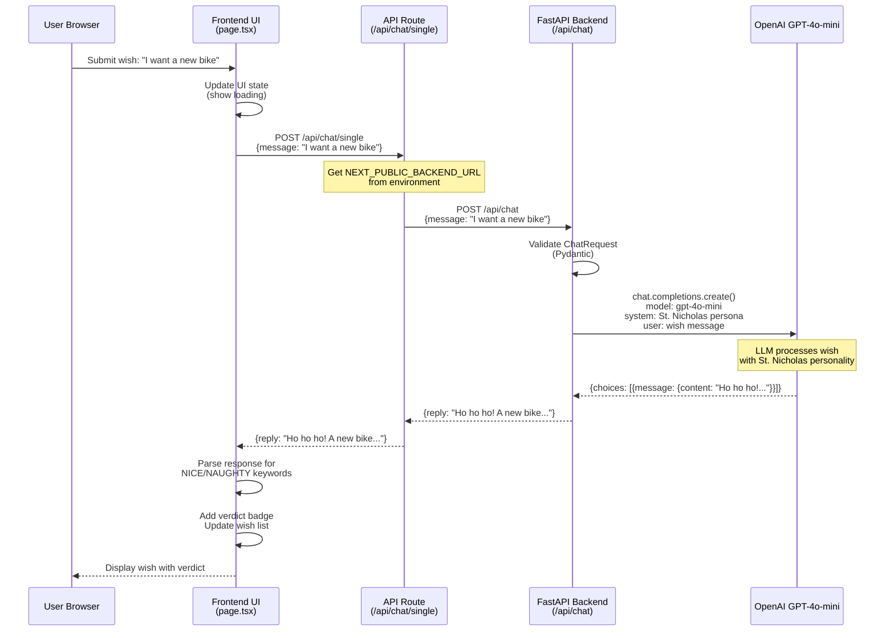

---

## 6. Santa Chat Flow (Sequence Diagram)

This sequence shows the complete chat message flow from user input to AI response.

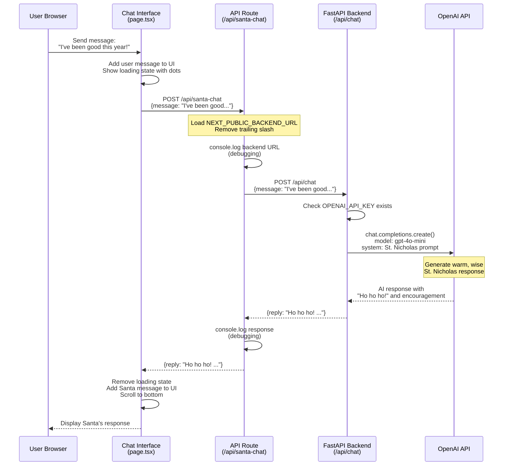

---

## 7. Frontend-Backend Communication Patterns

This diagram illustrates the API proxy pattern and how environment variables enable communication.

```mermaid
graph LR
    subgraph "Browser"
        USER_ACTION[User Action<br/>Submit wish / Send chat]
    end

    subgraph "Next.js Frontend (Vercel)"
        UI_COMPONENT[UI Component<br/>page.tsx]

        subgraph "API Routes (Proxy)"
            PROXY_ROUTE[API Route Handler<br/>/api/santa-chat/route.ts]
            ENV_VAR[process.env<br/>NEXT_PUBLIC_BACKEND_URL]
        end

        CORS_SAFE[CORS-safe<br/>Same-origin request]
    end

    subgraph "FastAPI Backend (Vercel)"
        CORS_MIDDLEWARE["CORS Middleware<br/>allow_origins=['*']"]
        ENDPOINT[POST /api/chat<br/>ChatRequest model]
        OPENAI_CLIENT[OpenAI Client]
    end

    subgraph "External API"
        OPENAI_API[OpenAI API<br/>GPT-4o-mini]
    end

    USER_ACTION --> UI_COMPONENT
    UI_COMPONENT -->|fetch /api/santa-chat| PROXY_ROUTE
    PROXY_ROUTE --> ENV_VAR
    ENV_VAR --> CORS_SAFE

    CORS_SAFE -->|HTTP POST<br/>Cross-origin request| CORS_MIDDLEWARE
    CORS_MIDDLEWARE --> ENDPOINT
    ENDPOINT --> OPENAI_CLIENT
    OPENAI_CLIENT --> OPENAI_API

    OPENAI_API -.->|Response| OPENAI_CLIENT
    OPENAI_CLIENT -.->|"{reply: '...'}"| ENDPOINT
    ENDPOINT -.->|JSON response| CORS_MIDDLEWARE
    CORS_MIDDLEWARE -.->|CORS headers added| PROXY_ROUTE
    PROXY_ROUTE -.->|"{reply: '...'}"| UI_COMPONENT

    style PROXY_ROUTE fill:#f59e0b,color:#fff
    style CORS_MIDDLEWARE fill:#22c55e,color:#fff
    style ENDPOINT fill:#009688,color:#fff
    style OPENAI_API fill:#7c3aed,color:#fff
    style ENV_VAR fill:#ef4444,color:#fff
```

---

## 8. Project File Structure

This diagram shows the complete file organization for both frontend and backend services.

```mermaid
graph TD
    ROOT[Session_03/app/]

    subgraph "Backend Structure"
        BE_DIR[backend-wish-list/]
        BE_API[api/]
        BE_INDEX[index.py]
        BE_ENV[.env]
        BE_PY[pyproject.toml]
        BE_REQ[requirements.txt]
        BE_VERCEL[vercel.json]
        BE_GI[.gitignore]
    end

    subgraph "Frontend Structure"
        FE_DIR[frontend-wish-list/]

        subgraph "App Directory"
            FE_APP[app/]
            FE_PAGE[page.tsx]
            FE_LAYOUT[layout.tsx]
            FE_GLOBALS[globals.css]

            subgraph "API Routes"
                FE_API[api/]
                FE_SANTA[santa-chat/route.ts]
                FE_SINGLE[chat/single/route.ts]
            end
        end

        subgraph "Components"
            FE_COMP[components/]
            FE_UI[ui/]
            FE_BUTTON[button.tsx]
            FE_INPUT[input.tsx]
            FE_PROGRESS[progress.tsx]
        end

        subgraph "Public Assets"
            FE_PUB[public/]
            FE_IMG[images/]
            FE_SANTA_IMG[cool-santa.png]
        end

        subgraph "Config Files"
            FE_PKG[package.json]
            FE_NEXT[next.config.ts]
            FE_TS[tsconfig.json]
            FE_ENV_LOCAL[.env.local]
        end
    end

    ROOT --> BE_DIR
    ROOT --> FE_DIR

    BE_DIR --> BE_API
    BE_API --> BE_INDEX
    BE_DIR --> BE_ENV
    BE_DIR --> BE_PY
    BE_DIR --> BE_REQ
    BE_DIR --> BE_VERCEL
    BE_DIR --> BE_GI

    FE_DIR --> FE_APP
    FE_APP --> FE_PAGE
    FE_APP --> FE_LAYOUT
    FE_APP --> FE_GLOBALS
    FE_APP --> FE_API
    FE_API --> FE_SANTA
    FE_API --> FE_SINGLE

    FE_DIR --> FE_COMP
    FE_COMP --> FE_UI
    FE_UI --> FE_BUTTON
    FE_UI --> FE_INPUT
    FE_UI --> FE_PROGRESS

    FE_DIR --> FE_PUB
    FE_PUB --> FE_IMG
    FE_IMG --> FE_SANTA_IMG

    FE_DIR --> FE_PKG
    FE_DIR --> FE_NEXT
    FE_DIR --> FE_TS
    FE_DIR --> FE_ENV_LOCAL

    style BE_INDEX fill:#009688,color:#fff
    style FE_PAGE fill:#0ea5e9,color:#fff
    style BE_ENV fill:#ef4444,color:#fff
    style FE_ENV_LOCAL fill:#ef4444,color:#fff
    style FE_SANTA fill:#f59e0b,color:#fff
    style FE_SINGLE fill:#f59e0b,color:#fff
```

---

## 9. Dual Deployment Architecture (Vercel)

This sequence diagram shows how code gets deployed to Vercel for both frontend and backend.

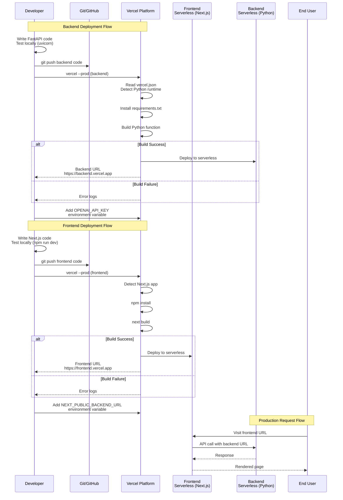

---

## 10. Local Development Workflow

This flowchart shows how to run both services simultaneously during development.

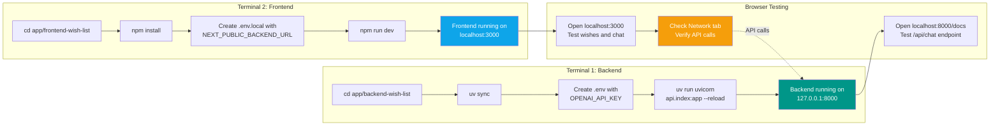

---

## 11. Environment Variables Security Flow

This diagram shows how environment variables are managed securely across local and production environments.

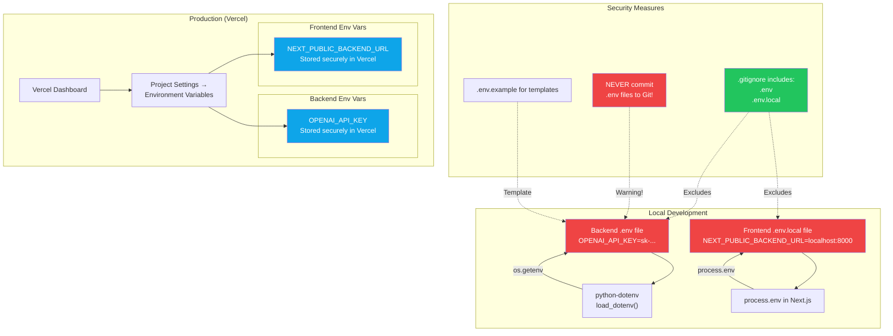

---

## 12. Integration Testing Workflow

This flowchart provides a decision-tree approach to testing the full-stack integration.

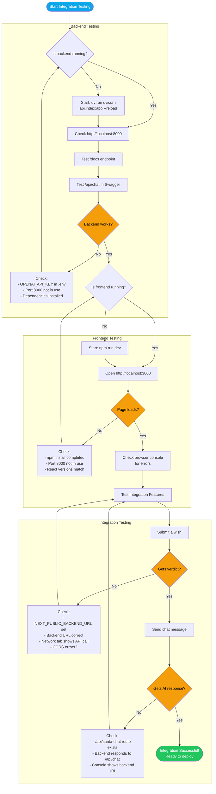

---

## 13. Troubleshooting Decision Tree

This comprehensive decision tree helps diagnose and fix common integration issues.

```mermaid
flowchart TD
    PROBLEM([Integration Issue?]) --> TYPE{What's the symptom?}

    TYPE -->|Frontend can't reach backend| ENV_ISSUE
    TYPE -->|CORS errors| CORS_ISSUE
    TYPE -->|Backend returns 500| BE500_ISSUE
    TYPE -->|Port already in use| PORT_ISSUE
    TYPE -->|React version errors| REACT_ISSUE

    subgraph ENV_ISSUE["Environment Variable Issues"]
        ENV1{Local or Production?}
        ENV1 -->|Local| ENV_LOCAL[Check .env.local exists<br/>NEXT_PUBLIC_BACKEND_URL<br/>set correctly]
        ENV1 -->|Production| ENV_PROD[Check Vercel Dashboard<br/>Environment Variables set]

        ENV_LOCAL --> ENV2{Correct format?}
        ENV_PROD --> ENV2

        ENV2 -->|No trailing slash| ENV3[Remove trailing /<br/>from URL]
        ENV2 -->|Missing http://| ENV4[Add http:// or https://]
        ENV2 -->|Wrong port| ENV5[Use :8000 for local<br/>Vercel URL for prod]

        ENV3 --> ENV_RESTART[Restart dev servers]
        ENV4 --> ENV_RESTART
        ENV5 --> ENV_RESTART
        ENV_RESTART --> FIXED1([Fixed!])
    end

    subgraph CORS_ISSUE["CORS Errors"]
        CORS1["Check backend<br/>api/index.py"]
        CORS1 --> CORS2{CORS middleware exists?}

        CORS2 -->|No| CORS3["Add CORSMiddleware<br/>with allow_origins=['*']"]
        CORS2 -->|Yes| CORS4{allow_origins set?}

        CORS4 -->|Set to specific origin| CORS5["Change to ['*'] for dev<br/>or add frontend URL"]
        CORS3 --> CORS_RESTART[Restart backend]
        CORS5 --> CORS_RESTART
        CORS_RESTART --> FIXED2([Fixed!])
    end

    subgraph BE500_ISSUE["Backend 500 Errors"]
        BE500_1{Local or Production?}
        BE500_1 -->|Local| BE500_LOCAL[Check .env file<br/>OPENAI_API_KEY set]
        BE500_1 -->|Production| BE500_PROD[Check Vercel Dashboard<br/>OPENAI_API_KEY set]

        BE500_LOCAL --> BE500_2{Key format correct?}
        BE500_PROD --> BE500_2

        BE500_2 -->|Should start with sk-| BE500_3[Verify OpenAI API key<br/>at platform.openai.com]
        BE500_3 --> BE500_4[Restart backend or<br/>redeploy to Vercel]
        BE500_4 --> FIXED3([Fixed!])
    end

    subgraph PORT_ISSUE["Port Conflicts"]
        PORT1{Which port?}
        PORT1 -->|3000| PORT_FE["kill -9 $(lsof -ti tcp:3000)"]
        PORT1 -->|8000| PORT_BE["kill -9 $(lsof -ti tcp:8000)"]

        PORT_FE --> PORT_RESTART[Restart dev server]
        PORT_BE --> PORT_RESTART
        PORT_RESTART --> FIXED4([Fixed!])
    end

    subgraph REACT_ISSUE["React Version Mismatch"]
        REACT1[Open package.json]
        REACT1 --> REACT2{react and react-dom<br/>both 19.2.1?}

        REACT2 -->|No| REACT3[Edit package.json<br/>Set both to 19.2.1]
        REACT3 --> REACT4[Delete node_modules<br/>and package-lock.json]
        REACT4 --> REACT5[npm install<br/>--legacy-peer-deps]
        REACT5 --> FIXED5([Fixed!])

        REACT2 -->|Yes| REACT6[Check for conflicting<br/>@radix-ui versions]
        REACT6 --> REACT4
    end

    style FIXED1 fill:#22c55e,color:#fff
    style FIXED2 fill:#22c55e,color:#fff
    style FIXED3 fill:#22c55e,color:#fff
    style FIXED4 fill:#22c55e,color:#fff
    style FIXED5 fill:#22c55e,color:#fff
    style PROBLEM fill:#ef4444,color:#fff
```

---

## 14. Session Comparison: Progression from 1 to 3

This diagram shows how the three sessions build upon each other in technology, focus, and deployment complexity.

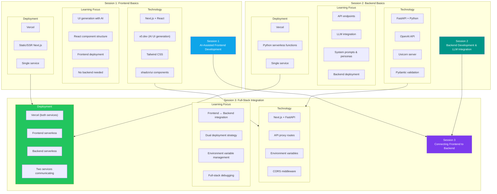

---

## 15. Quick Reference Tables

### Commands Table

| Task | Command |
|------|---------|
| **Backend Development** |
| Install uv | `curl -LsSf https://astral.sh/uv/install.sh \| sh` |
| Install backend dependencies | `cd app/backend-wish-list && uv sync` |
| Run backend server | `uv run uvicorn api.index:app --reload --port 8000` |
| Test backend health | `curl http://localhost:8000` |
| View API docs | `open http://localhost:8000/docs` |
| Kill backend port | `kill -9 $(lsof -ti tcp:8000)` |
| **Frontend Development** |
| Install frontend dependencies | `cd app/frontend-wish-list && npm install` |
| Run frontend dev server | `npm run dev` |
| Build frontend for production | `npm run build` |
| Run production build | `npm run start` |
| Lint frontend code | `npm run lint` |
| Kill frontend port | `kill -9 $(lsof -ti tcp:3000)` |
| Fix peer dependency issues | `npm install --legacy-peer-deps` |
| **Deployment** |
| Deploy backend to Vercel | `cd app/backend-wish-list && vercel --prod` |
| Deploy frontend to Vercel | `cd app/frontend-wish-list && vercel --prod` |
| View Vercel logs | `vercel logs [deployment-url]` |
| Add Vercel env variable | `vercel env add VAR_NAME production` |

### Endpoints Table

| Service | Method | Path | Purpose | Request Body | Response |
|---------|--------|------|---------|--------------|----------|
| **Backend** |
| Backend | GET | `/` | Health check | None | `{"status": "ok"}` |
| Backend | POST | `/api/chat` | Chat with St. Nicholas | `{"message": "..."}` | `{"reply": "..."}` |
| Backend | GET | `/docs` | Swagger UI | None | HTML page |
| Backend | GET | `/redoc` | ReDoc UI | None | HTML page |
| **Frontend API Routes** |
| Frontend | POST | `/api/santa-chat` | Proxy to backend `/api/chat` | `{"message": "..."}` | `{"reply": "..."}` |
| Frontend | POST | `/api/chat/single` | Wish evaluation (proxy) | `{"message": "..."}` | `{"reply": "..."}` |

### Environment Variables Table

| Variable | Service | Location | Value (Example) | Purpose |
|----------|---------|----------|-----------------|---------|
| `OPENAI_API_KEY` | Backend | `.env` (local) Vercel Dashboard (prod) | `sk-proj-abc123...` | Authenticate with OpenAI API |
| `NEXT_PUBLIC_BACKEND_URL` | Frontend | `.env.local` (local) Vercel Dashboard (prod) | `http://localhost:8000` (local) `https://backend.vercel.app` (prod) | Backend URL for API calls |

### File Checklist Table

| File | Location | Purpose | Must Edit? |
|------|----------|---------|------------|
| **Backend Files** |
| `api/index.py` | `app/backend-wish-list/` | FastAPI application | ✓ Yes |
| `pyproject.toml` | `app/backend-wish-list/` | Python project metadata | ✓ Yes |
| `requirements.txt` | `app/backend-wish-list/` | Vercel dependencies | ✓ Yes |
| `vercel.json` | `app/backend-wish-list/` | Vercel routing config | ✓ Yes |
| `.env` | `app/backend-wish-list/` | API keys (local) | ✓ Yes |
| `.gitignore` | `app/backend-wish-list/` | Ignore secrets | ✓ Yes |
| **Frontend Files** |
| `app/page.tsx` | `app/frontend-wish-list/` | Main wish list page | ✓ Yes (if customizing UI) |
| `app/api/santa-chat/route.ts` | `app/frontend-wish-list/` | Chat proxy to backend | ✓ Yes |
| `app/api/chat/single/route.ts` | `app/frontend-wish-list/` | Wish evaluation proxy | ✓ Yes |
| `package.json` | `app/frontend-wish-list/` | Dependencies | ✓ Yes (versions) |
| `next.config.ts` | `app/frontend-wish-list/` | Next.js configuration | Optional |
| `.env.local` | `app/frontend-wish-list/` | Environment variables (local) | ✓ Yes |
| `tsconfig.json` | `app/frontend-wish-list/` | TypeScript configuration | Optional |

---

*These diagrams are rendered using [Mermaid.js](https://mermaid.js.org/). View them in any Markdown viewer that supports Mermaid (GitHub, VS Code with extensions, Cursor IDE, etc.).*
